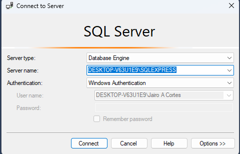
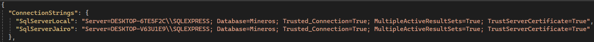
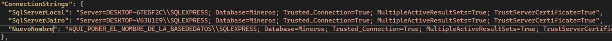
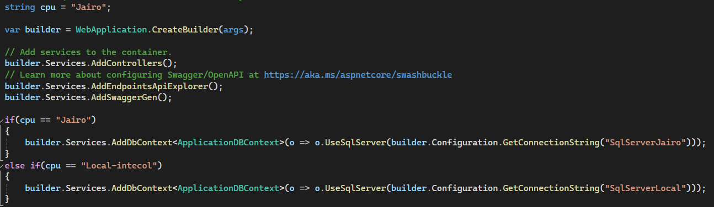
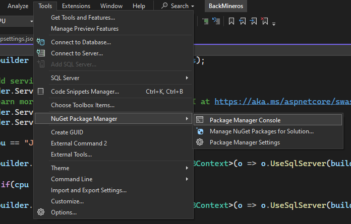
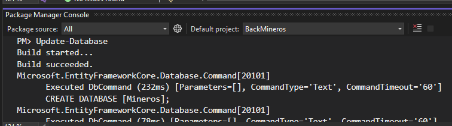
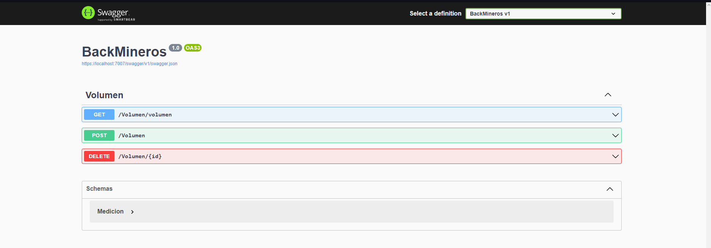

# Back-End Mineros Intecol.SAS

Aplicación Asp.Net para el Back-end de mineros.

## Requisitos

- Visual Studio

- Sql Server express

- Personas de la costa caribe hijos de mujeres de útero sociable.

## Instalación

El repositorio ya tiene instaladas las librerias necesarias solo toca ejecutarlas.

1. Configurar la base de datos.

    -   Lo primero es agregar la base de datos al archivo de configuración JSON de la aplicación.

        Ingresa a Sql Server Management Studio (SSMS)
    
        

        Copia el nombre de la base de datos, en el caso del ejemplo es: DESKTOP-V63U1E9. Se omite la parte de '\SQLEXPRESS'

        Abrir el archivo appsettings.json.

        

        Agregar la siguiente linea de codigo. Reemplazar "NuevoNombre" por un nombre para la bandera que se desee usar, y reemplazar "AQUI_PONER_EL_NOMBRE_DE_LA_BASEDEDATOS" por el nombre que se obtuvo en el paso anterior. No olvidar poner una coma antes de ingresar el nuevo atributo ya que estamos trabajando un objeto JSON y estamos agregando un nuevo objeto.

            "NuevoNombre": "AQUI_PONER_EL_NOMBRE_DE_LA_BASEDEDATOS\\SQLEXPRESS; Database=Mineros; Trusted_Connection=True; MultipleActiveResultSets=True; TrustServerCertificate=True"
        
        Debe quedar algo así:

        

        Abrir el archivo Program.cs para agregar la nueva ruta de la base de datos.

        

        Acá se puede modificar un if o se agrega otro else if para modificar la variable cpu y agregar el deseado. Reemplazar nuevo nombre por el nombre asignado en el archivo appsettings.json.

            builder.Services.AddDbContext<ApplicationDBContext>(o => o.UseSqlServer(builder.Configuration.GetConnectionString("NuevoNombre")));

    -   Para configurarla toca abrir la consola de comandos del NuGet Package Manager.
    
        Tools -> NuGet Package Manager -> Package Manager Control

        

        En la parte inferior del Visual Studio se abrirá una consola donde se debe ingresar el siguiente comando:

            Update-Database
        
        

    Una vez realizados estos pasos debe aparecer la nueva base de datos en el sql express.

2. Ejecutar el Back-end

    Para ejecutar el Back ejecutelo como cualquier aplicación de Visual Studio.

    Se abre el explorar por defecto y dejará hacer pruebas con las consultas. Si ve la siguiente ventana quedó instalado el Back con la base de datos.

    